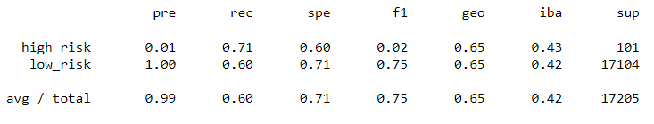
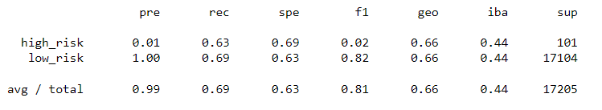
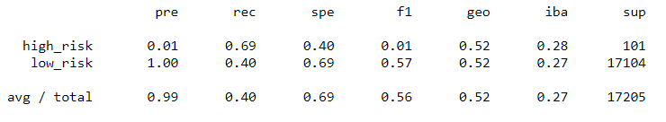
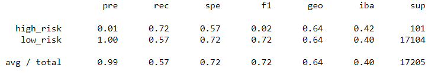
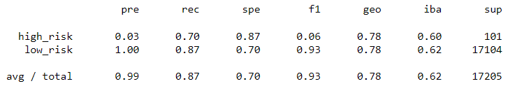
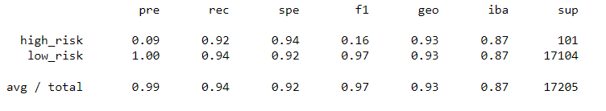

# Credit Risk Analysis/Supervised Machine Learning (Module Challenge 17)

[Link to Deliverable 1 & 2 Credit Risk Resampling code](credit_risk_resampling.ipynb)

[Link to Deliverable 3 Credit Risk Ensemble code](credit_risk_ensemble_.ipynb)

## Credit Risk Analysis

### Overview
The purpose of this project is to apply machine learning to solve a real-world challenge: credit card risk.

Credit risk is an inherently unbalanced classification problem, as good loans easily outnumber risky loans. 

Therefore, this assessment applies different techniques to train and evaluate models with unbalanced classes.

Using the credit card credit dataset from LendingClub, a peer-to-peer lending services company, this assessment applies the following six (6) supervised machine learning models:

* Oversampling using RandomOverSampler and SMOTE algorithms
* Undersampling using the ClusterCentroids algorithm
* Combination oversampling and undersampling using the SMOTEENN algorithm
* Ensemble techniques using the BalancedRandomForestClassifier and EasyEnsembleClassifier algorithms

## Results

The analysis returned the following results:

* Random Oversample:
  Balanced Accuracy Score = .66
  Precision Score = .99
  Recall Score = .60
  F1 Score = .75

  
  
* SMOTE Oversample: 
  Balanced Accuracy Score = .66
  Precision Score = .99
  Recall Score = .69
  F1 Score = .81

  

* ClusterCentroids Undersample: 
  Balanced Accuracy Score = .54
  Precision Score = .99
  Recall Score = .40
  F1 Score = .56

  

* SMOTEENN Combination: 
  Balanced Accuracy Score = .64
  Precision Score = .99
  Recall Score = .57
  F1 Score = .72

  

* Balanced Random Forest Ensemble: 
  Balanced Accuracy Score = .79
  Precision Score = .99
  Recall Score = .87
  F1 Score = .93

  

* Easy Ensemble: 
  Balanced Accuracy Score = .93
  Precision Score = .99
  Recall Score = .94
  F1 Score = .97

  

## Summary

All the supervised machine learning models resulted in high precision (measure of how reliable a positive classification is).

However, the recall/accuracy (ability of the classifier to find all the positive samples) of the ensemble models was far greater than the resampling algorithms.  

In particular, the EasyEnsembleClassifier ensemble model resulted in high precision (.99), high recall/accuracy (.94), and high F1 (.97) scores.

Based on these results, the EasyEnsembleClassifier model should be used to evaluate credit risk.

This project was prepared using the following:
* Python 3.7
* Scikit-learn
* imbalanced-learn
* Jupyter Notebook
